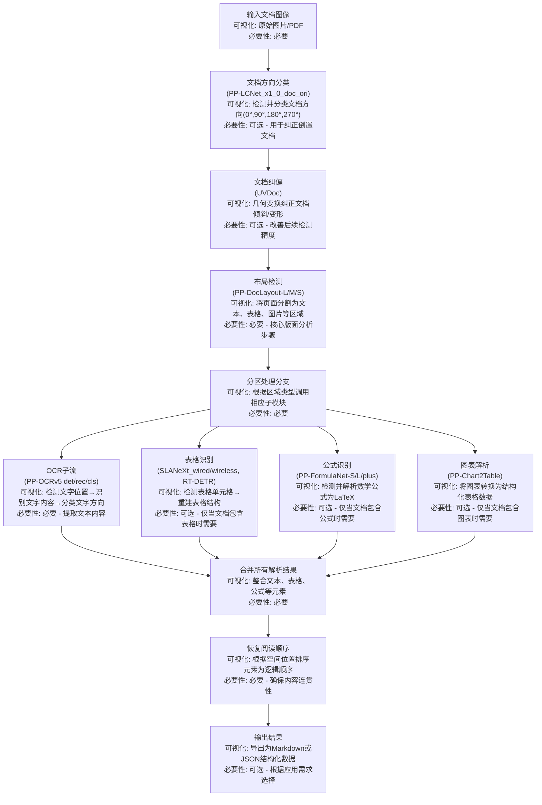

```mermaid
graph TD
    A["输入文档图像\n可视化: 原始图片/PDF\n必要性: 必要"] --> B["文档方向分类\n(PP-LCNet_x1_0_doc_ori)\n可视化: 检测并分类文档方向(0°,90°,180°,270°)\n必要性: 可选 - 用于纠正倒置文档"]
    
    B --> C["文档纠偏\n(UVDoc)\n可视化: 几何变换纠正文档倾斜/变形\n必要性: 可选 - 改善后续检测精度"]
    
    C --> D["布局检测\n(PP-DocLayout-L/M/S)\n可视化: 将页面分割为文本、表格、图片等区域\n必要性: 必要 - 核心版面分析步骤"]
    
    D --> E["分区处理分支\n可视化: 根据区域类型调用相应子模块\n必要性: 必要"]
    
    E --> F["OCR子流\n(PP-OCRv5 det/rec/cls)\n可视化: 检测文字位置→识别文字内容→分类文字方向\n必要性: 必要 - 提取文本内容"]
    
    E --> G["表格识别\n(SLANeXt_wired/wireless, RT-DETR)\n可视化: 检测表格单元格→重建表格结构\n必要性: 可选 - 仅当文档包含表格时需要"]
    
    E --> H["公式识别\n(PP-FormulaNet-S/L/plus)\n可视化: 检测并解析数学公式为LaTeX\n必要性: 可选 - 仅当文档包含公式时需要"]
    
    E --> I["图表解析\n(PP-Chart2Table)\n可视化: 将图表转换为结构化表格数据\n必要性: 可选 - 仅当文档包含图表时需要"]
    
    F --> J["合并所有解析结果\n可视化: 整合文本、表格、公式等元素\n必要性: 必要"]
    
    G --> J
    H --> J
    I --> J
    
    J --> K["恢复阅读顺序\n可视化: 根据空间位置排序元素为逻辑顺序\n必要性: 必要 - 确保内容连贯性"]
    
    K --> L["输出结果\n可视化: 导出为Markdown或JSON结构化数据\n必要性: 可选 - 根据应用需求选择"]
```